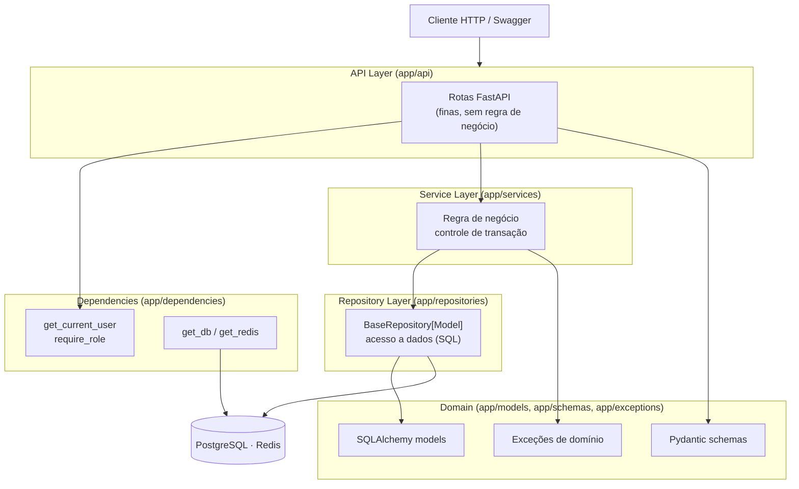

# Arquitetura — StockGuardian

## Visão geral

Arquitetura em camadas inspirada em **Clean Architecture** + **DDD simplificado**.
A dependência aponta sempre para dentro: rotas dependem de serviços, que dependem
de repositórios e do domínio — nunca o contrário.

## Responsabilidades por camada

| Camada | Pasta | Responsabilidade |
|--------|-------|------------------|
| API | `app/api` | Receber request, validar via Pydantic, delegar ao serviço, serializar resposta. **Sem** regra de negócio. |
| Dependencies | `app/dependencies` | Injeção de sessão DB, Redis, usuário atual e checagem de papel (RBAC). |
| Service | `app/services` | Regra de negócio e orquestração; **dono da transação** (`commit`). |
| Repository | `app/repositories` | Único lugar que emite SQL. `BaseRepository` genérico + repos específicos. |
| Models | `app/models` | Entidades SQLAlchemy 2.x (mapped_column tipado). |
| Schemas | `app/schemas` | Contratos de entrada/saída (Pydantic v2). |
| Exceptions | `app/exceptions` | Erros de domínio + handlers que os traduzem para HTTP. |
| Core | `app/core` | Config, logging, segurança, conexões (DB/Redis). |

## Decisões de design

- **SQLAlchemy 2.x async (asyncpg)** — aproveita o event loop do FastAPI para I/O concorrente.
- **Repository Pattern + Service Layer** — testabilidade (repos mockáveis) e SRP.
- **Transação no serviço** — repos fazem `flush`; o serviço decide `commit`, permitindo
  atomicidade de múltiplas operações (ex.: atualizar produto + registrar movimento).
- **Lock pessimista** (`SELECT ... FOR UPDATE`) em movimentações para evitar saldo
  incorreto sob concorrência.
- **`balance_after` no histórico** — snapshot do saldo por movimento, evitando recomputo.
- **Exceções de domínio desacopladas de HTTP** — o mapeamento status↔erro fica
  centralizado em `app/exceptions/handlers.py`.
- **JWT access + refresh com whitelist no Redis** — refresh rastreado por `jti`,
  permitindo revogação imediata (logout) e rotação de tokens.
- **Logging estruturado (structlog)** com `correlation_id` por request.

## Regra de negócio central: movimentação de estoque

`MovementService.create` (`app/services/movement.py`):

1. Carrega o produto com `FOR UPDATE` (serializa concorrência).
2. Calcula o novo saldo (`_apply_movement`): `IN` soma, `OUT` subtrai, `ADJUSTMENT` define absoluto.
3. `OUT` que deixaria saldo < 0 → `InsufficientStockError` (HTTP 409).
4. Atualiza `product.quantity` e insere `StockMovement` na **mesma transação**.
